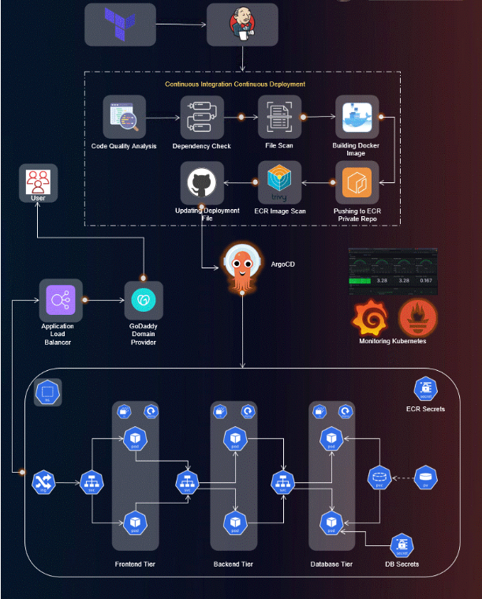

# Advanced End-to-End DevSecOps Kubernetes Three-Tier Project

## Project Overview

This project demonstrates a robust, secure, and scalable DevSecOps pipeline using AWS EKS, Jenkins, ArgoCD, Prometheus, Grafana, and other cloud-native tools. The project implements a comprehensive DevSecOps pipeline on AWS with Kubernetes, covering the following components:

### Key Components

1. **IAM User Setup**: Create an IAM user on AWS with necessary permissions to support deployment and management securely.
   
2. **Infrastructure as Code (IaC)**: Use Terraform and AWS CLI to set up a Jenkins server on an AWS EC2 instance, ensuring infrastructure is reproducible and manageable.
   
3. **Jenkins Server Configuration**: Install and configure essential tools on the Jenkins server:
   - Jenkins
   - Docker
   - Sonarqube
   - Terraform
   - Kubectl
   - AWS CLI
   - Trivy

4. **EKS Cluster Deployment**: Use `eksctl` to create an Amazon EKS cluster, a managed Kubernetes environment on AWS, to host applications.
   
5. **Load Balancer Configuration**: Configure an AWS Application Load Balancer (ALB) to balance traffic across the EKS cluster, ensuring scalability and availability.
   
6. **Amazon ECR Repositories**: Set up private repositories on Amazon Elastic Container Registry (ECR) for storing Docker images of both frontend and backend components.
   
7. **ArgoCD Installation**: Install and configure ArgoCD, a GitOps tool for continuous delivery, to manage application deployment to the EKS cluster.
   
8. **Sonarqube Integration**: Integrate Sonarqube into the DevSecOps pipeline for code quality and security analysis, enhancing application reliability and security.
   
9. **Jenkins Pipelines**: Develop Jenkins pipelines to automate the deployment of backend and frontend applications to the EKS cluster.
   
10. **Monitoring Setup**: Implement monitoring for the EKS cluster using Helm to deploy Prometheus and Grafana, providing insights into cluster health and performance.
   
11. **ArgoCD Application Deployment**: Deploy the Three-Tier application using ArgoCD, including:
    - Database
    - Backend
    - Frontend
    - Ingress components

12. **DNS Configuration**: Configure DNS settings to allow access to the application through custom subdomains.

13. **Data Persistence**: Set up persistent volumes and persistent volume claims for database pods, ensuring data persistence across pod restarts.

14. **Conclusion and Monitoring**: Summarize the project’s key achievements and monitor the EKS cluster’s performance using Grafana.

## Prerequisites

- AWS account with necessary permissions.
- Installed tools: Terraform, AWS CLI, eksctl, kubectl.
- Basic understanding of Kubernetes, Jenkins, and Docker.

## Monitoring and Visualization

- Access Prometheus and Grafana dashboards to monitor Kubernetes clusters.
- Use ArgoCD to manage continuous deployments across environments.
